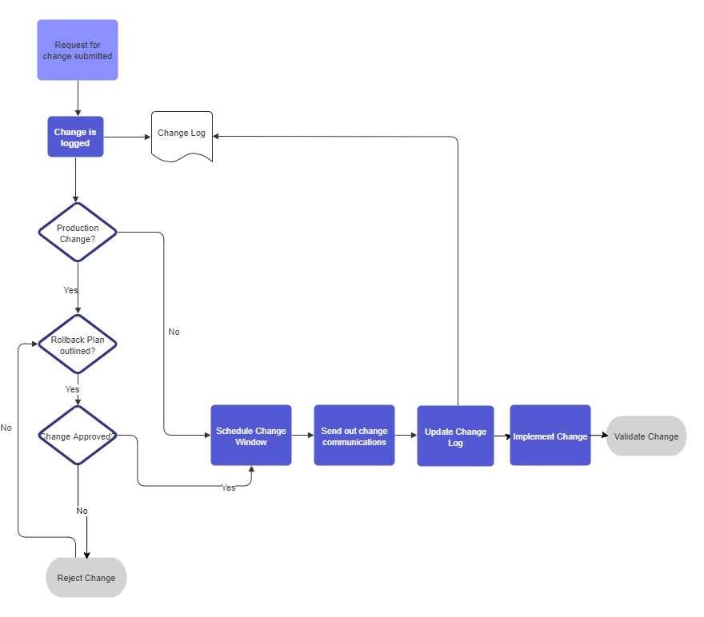

As the Cloud Platform is developed, frequent change will occur on the platform as new features and functionalities are released. In order to ensure that users of the platform are aware of the changes, the need for a standard way of communicating change is required.

As this is a lightweight informative process, changes will be approved by internal leads or managers rather than seek sign off from external stakeholders.

Before raising a change, speak to stakeholders about when it would be appropriate for the changes to be applied. Try to accommodate the end users in terms of timing, if possible, including asking about working hours. Give as much notice as possible. If things are very short notice, explain why.

### When to raise a change request

A change request should be raised when a change is going to affect the stakeholders through a change that the team implements. Operational exercises shouldn’t require a change request (e.g. increasing disk size on a server) as the change was requested by a stakeholder.  

### Change Process

The above flow diagram shows the high level decisions made to communicate change to outside teams

### Change Communication 

Depending on the environment, changes will be communicated out in the below methods:

##### Production

Email is sent to Monsur Zaman which will then be communicated to the whole council.

The change is also communicated through Slack to the #aws-outage channel

##### Staging and Development 

Developer working on the change sends an email to HackIT and also communicates through Slack to the #aws-outage channel

#### Template

Requester:

Date:

Request Name:

Reason for change:

Change Description:

Environment:

Impact/Risk Assessment:

	Scope of change:

	Implementation time:

	Risk:

	Rollback:

##### Requester

The team or person who has requested a change to the platform (Can be yourself or CE if it is on behalf of the team).

##### Date

Date the request was submitted

##### Request name

Name of the request that summarises the change

##### Reason for change

How did this request come about? 

##### Change description

What is going to be changed? What is the outcome of the change?

##### Environment

Is this a dev, staging or production change? This can be helpful to stakeholders who may only be interested in a change in a particular environment.

##### Impact/Risk Assessment

Consider the effects of the change on the platform, what kind of risks are associated with those, and how long the change will take to implement.

###### Scope

What systems are affected by this change? This is important to stakeholders who may rely on certain systems being unaffected during a change window.

###### Implementation Time and Duration

How long will it take to roll this change out? This is important to stakeholders as they may be using the system for important processes during this time. It is important to note that changes will need to be made between 20:00 - 06:00 for production systems.

###### Rollback Plan

What is the plan to revert this change if there is a problem? (Note: This should only really matter to production environments since development and staging environments are used for active testing).

###### Risk

What are the risks of this change if it goes wrong? How much in the scope of the change will be affected and for how long? Will there be a cost or outage of the platform if a change goes wrong? This is probably the part that stakeholders will be most concerned about.

### Change Log

The change log is kept [here](https://docs.google.com/spreadsheets/u/0/d/1uJ9H1uqGFMZuXnzLvHKEtQFvA36PssqRgulH_P9Mxk0/edit) and should be filled out before a change is made. The fields that are filled in can then be sent to the Service Desk for communication.

We should keep a log of all change requests that have been created as a form of auditing and being able to track changes made.
