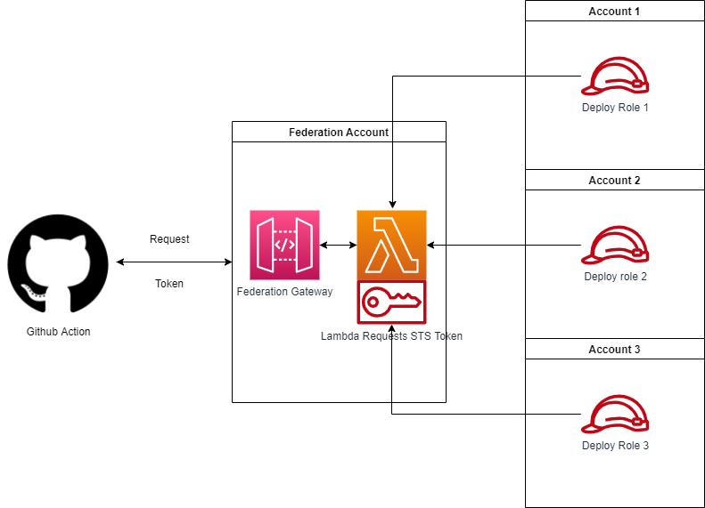

The Github action aws-auth provides a mechanism for authentication to AWS without the need to store credentials on Github.

AWS offers an integration for this, known as an OIDC Provider. The issue with AWS resource is that contextual or transitive tags cannot be passed to an assumed role which has the possibility to restrict making use of certain IAM policies that can Allow or Deny actions based on tag.

* A workflow will call the Github action for aws authentication [link to repo] and provide the role they wish to assume, as well as any transitive tags if desired.
* The action will send a request to the API Gateway containing a JWT token. The API will authorize the JWT token based on the identity of the source.
* The lambda will then assume a role that allows the lambda to assume it after passing on some contextual Github information as tags, as well as any transitive tags specified in the request.
* The API then sends assumed role credentials which are then set as environment variables for future steps.
* Session credentials expire and the session can no longer be used.

If AWS do decide to allow their OIDC resource to pass tags to sessions then that should be considered to use instead of the current solution as is the preference for SaaS over custom solutions.
