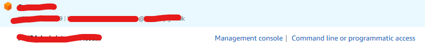

This guide shows how to set programmatic access keys for AWS.

* Go to the Hackney Apps URL and select the account you want access to.
* Choose `Command line or programmatic access`

* Follow the pop up guide
