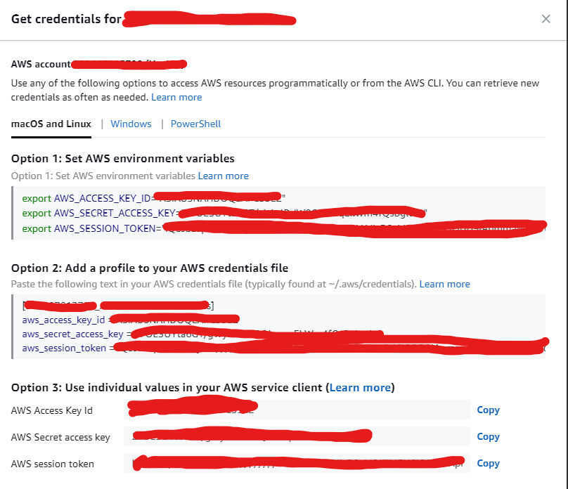

This guide demonstrates how to set AWS Credentials on your local machine.

* Navigate to the AWS login page
* Select your account from the dropdown and choose `Command line or programmatic access`

* Follow the pop up instructions
